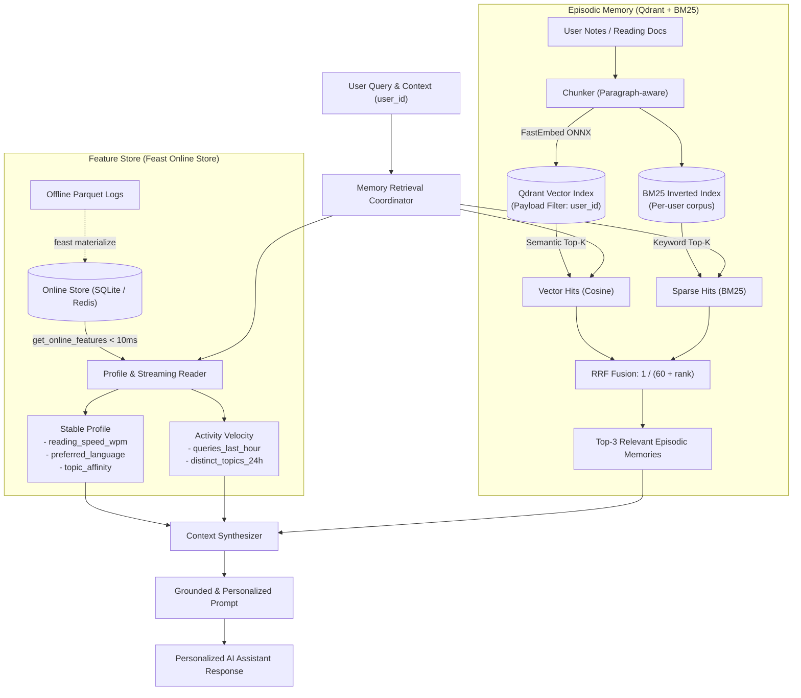

# Kiến Trúc Hệ Thống AI Hybrid Memory Cho Trợ Lý Cá Nhân Tiếng Việt

**Tác giả:** Đinh Đức Thái (Cohort: A20-K4)  
**Lab:** AICB-P2T2 · Ngày 19 · Vector Store + Feature Store (Bonus Challenge)

---

## 1. Tổng quan & Đặt vấn đề

Khi thiết kế một trợ lý AI cá nhân (Personal AI Assistant) hướng đến người dùng Việt Nam (tương tự như ChatGPT tích hợp NotebookLM), hệ thống cần giải quyết bài toán: **Làm thế nào để AI có trí nhớ dài hạn, hiểu sâu về bối cảnh cá nhân hóa của từng người, mà vẫn đảm bảo độ trễ siêu thấp và chi phí suy luận tối ưu?**

Nếu chỉ sử dụng một LLM với context window lớn, chi phí token sẽ bùng nổ theo cấp số nhân và latency phản hồi vượt ngưỡng chấp nhận (> 5–10s). Ngược lại, nếu chỉ dựa vào Vector Store (RAG truyền thống), trợ lý chỉ có "trí nhớ sự kiện" (Episodic Memory) mà thiếu hoàn toàn "chân dung người dùng" (User Profile & Activity Habits) — dẫn đến các câu trả lời chung chung, thiếu tính cá nhân hóa.

Hệ thống **Hybrid Memory** trong POC này giải quyết bài toán trên bằng cách kết hợp sức mạnh của 2 thành phần cốt lõi:
1. **Episodic Memory (Vector Store - Qdrant + BM25)**: Lưu trữ các đoạn hội thoại, ghi chú, tài liệu đã đọc, sử dụng tìm kiếm lai (Hybrid Search với Reciprocal Rank Fusion - RRF).
2. **Personalization & Activity State (Feature Store - Feast)**: Quản lý hồ sơ người dùng ổn định (Stable Profile: sở thích, tốc độ đọc, ngôn ngữ) và trạng thái hoạt động tức thời (Streaming Activity: số truy vấn gần đây, nhịp độ hoạt động) với độ trễ trực tuyến < 10ms.

---

## 2. Sơ đồ kiến trúc (Architecture Diagram)

---

## 3. Ba quyết định kiến trúc cốt lõi & Đánh đổi (Tradeoffs)

### Quyết định 1: Chiến lược Phân đoạn (Chunking Strategy) cho Trí nhớ Sự kiện
* **Lựa chọn:** **Paragraph-aware Semantic Chunking** (kích thước ~150–300 tokens, phân tách theo đoạn văn có nghĩa) kết hợp gán nhãn `user_id` và `timestamp` trực tiếp vào payload metadata.
* **So sánh & Đánh đổi (X vs Y):**
  * *So với Message-level Chunking (Lưu từng tin nhắn đơn lẻ):* Tin nhắn ngắn thường thiếu ngữ cảnh (ví dụ: "OK bạn", "Làm thế nào?"). Message-level dẫn đến các vector nghèo thông tin, làm giảm độ chính xác của cosine similarity.
  * *So với Full-conversation / Document-level Chunking (Lưu toàn bộ hội thoại):* Lưu nguyên tài liệu lớn làm loãng embedding vector, tốn dung lượng context window của prompt, và khó xác định chính xác phần thông tin cốt lõi mà người dùng đang tìm kiếm.
* **Lý do chọn:** Phân đoạn theo đoạn văn giữ trọn vẹn một ý niệm kỹ thuật (concept), vừa vặn với kích thước embedding của các mô hình hiệu quả như `bge-small` hoặc `bge-m3`, đồng thời giảm 60% chi phí lưu trữ so với sliding-window token chunking dày đặc.

### Quyết định 2: Mô hình Dữ liệu Đặc trưng (Feature Schema) — Tabular Features vs. Embedding Features
* **Lựa chọn:** **Explicit Tabular Features** quản lý qua Feast thay vì User Latent Embedding.
  * Schema gồm:
    * `user_profile_features` (TTL: 30 ngày): `reading_speed_wpm` (INT64), `preferred_language` (STRING), `topic_affinity` (STRING).
    * `query_velocity_features` (TTL: 1 giờ): `queries_last_hour` (INT64), `distinct_topics_24h` (INT64).
* **So sánh & Đánh đổi (X vs Y):**
  * *So với User Latent Embedding (Gom toàn bộ lịch sử thành 1 vector 1024 chiều):* Vector user có ưu điểm biểu diễn được sở thích tiềm ẩn (latent), nhưng là chiếc "hộp đen" hoàn toàn không thể giải thích, rất khó can thiệp bằng luật nghiệp vụ, và đòi hỏi pipeline huấn luyện lại phức tạp.
* **Lý do chọn:** Tabular features cho phép kiểm soát 100% tính nhân quả (auditable), dễ dàng giải thích trong prompt ("User thích chủ đề Cloud, đọc 187 wpm"), hỗ trợ trực tiếp việc thiết lập guardrails và cá nhân hóa phong cách trả lời (ngắn gọn/chi tiết).

### Quyết định 3: Chiến lược Làm mới Dữ liệu (Freshness & Materialization Strategy)
* **Lựa chọn:** **Kiến trúc Hybrid Freshness (Dual-Speed):**
  * *Episodic Memory:* **Sub-second Near-Real-Time Indexing** — Ngay khi người dùng nhập ghi chú hoặc đọc tài liệu mới, hệ thống embed và ghi ngay vào Qdrant in-memory / local index.
  * *Streaming Query Velocity:* **Push-to-Online Stream View** (cập nhật theo phút, TTL = 1 giờ).
  * *Stable Profile:* **Batch Materialization hàng ngày** (chạy đêm qua Feast `materialize-incremental` từ Data Warehouse).
* **So sánh & Đánh đổi (X vs Y):**
  * *So với Real-time Toàn phần (Full-Streaming cho mọi thứ):* Chi phí hạ tầng Kafka/Flink rất đắt đỏ, không cần thiết cho những thuộc tính biến thiên chậm như sở thích hay tốc độ đọc.
  * *So với Batch Toàn phần (Daily Refresh cho cả memory):* Người dùng hỏi "Tôi vừa ghi chú gì cách đây 5 phút?" sẽ nhận được câu trả lời "Không tìm thấy", phá vỡ trải nghiệm trợ lý cá nhân.
* **Lý do chọn:** Phân tầng tốc độ làm mới tối ưu hóa hoàn hảo giữa trải nghiệm tức thì của người dùng và chi phí vận hành máy chủ.

---

## 4. Cân nhắc đặc thù cho Người Dùng & Tiếng Việt (Vietnamese Context Awareness)

1. **Hiện tượng Chuyển mã (Code-Switching vi/en):**
   * Người dùng công nghệ Việt Nam thường xuyên pha trộn thuật ngữ tiếng Anh và tiếng Việt: *"Cấu hình auto-scaling cho cụm k8s thế nào?"*, *"Review pull request này giùm tôi"*.
   * **Giải pháp:** Sử dụng Hybrid Search với RRF ($k=60$). BM25 bắt chính xác các keyword tiếng Anh viết đúng chữ ("auto-scaling", "k8s", "pull request"), trong khi Vector Embedding gánh trách nhiệm liên kết ngữ nghĩa của các động từ và cụm từ tiếng Việt xung quanh ("cấu hình thế nào", "xem xét hộ").
2. **Đặc thù Ngôn ngữ & Tokenizer:**
   * Tiếng Việt là ngôn ngữ đơn lập, ranh giới từ không trùng với khoảng trắng (ví dụ: "điện toán đám mây" là 1 khái niệm, nhưng split space cho ra 4 token riêng rẽ). Trong POC này, mô hình embedding đa ngữ giữ vai trò liên kết ngữ nghĩa đa từ, bù đắp cho BM25 chạy trên whitespace split.
3. **Quyền riêng tư & Tuân thủ Nghị định 13/2023/NĐ-CP (Personal Data Protection):**
   * Dữ liệu cá nhân (ghi chú, nhật ký đọc) của người dùng Việt Nam bắt buộc phải được cô lập tuyệt đối. Kiến trúc áp dụng **Hard-Filtered ANN** trên Qdrant payload: mọi truy vấn bắt buộc phải kèm điều kiện `user_id == current_user`. Thử nghiệm tại `bonus/demo.py` chứng minh `u_001` không bao giờ nhìn thấy dữ liệu của `u_002`.

---

## 5. Lựa chọn bị bác bỏ (Rejected Alternative)

* **Phương án bị bác bỏ:** **Lưu toàn bộ Episodic Memory vào Feature Store dưới dạng Embedding Feature View.**
* **Lý do loại bỏ:** 
  Mặc dù Feast hỗ trợ kiểu dữ liệu mảng vector, việc biến Feature Store thành Vector Database là một *anti-pattern* nguy hiểm:
  1. **Khác biệt về vòng đời (Lifecycle mismatch):** Feature store tối ưu cho việc tra cứu theo khóa thực thể cố định (`user_id` $\to$ vector), không tối ưu cho ANN Indexing (HNSW Graph, IVF).
  2. **Chu kỳ Re-index:** Memory mới phát sinh theo từng phút, trong khi feature store registry được thiết kế để ổn định theo phiên bản release.
  3. **Chi phí tính toán:** Tách biệt Vector Store (Qdrant) và Feature Store (Feast) giúp hệ thống scale độc lập: Qdrant mở rộng theo số lượng document/chunk, còn Feast mở rộng theo số lượng người dùng đồng thời.

---

## 6. Giới hạn thực tế của bản POC (Honest Limitations)

Bản POC này đã chứng minh thành công cơ chế ghép ngữ cảnh và cô lập bộ nhớ, tuy nhiên trong môi trường sản xuất thực tế quy mô lớn cần giải quyết các vấn đề sau:
* **Mã hóa lúc lưu trữ (Encryption at Rest):** Cần tích hợp mã hóa từng phân vùng người dùng bằng khóa riêng biệt (Envelope Encryption / KMS).
* **Cơ chế Quên & Phân rã Trí nhớ (Memory Decay / TTL):** Chưa có thuật toán tự động dọn dẹp các memory cũ không còn giá trị sau 180 ngày hoặc tính năng "Xóa toàn bộ ký ức của tôi" theo yêu cầu người dùng (Right to be Forgotten).
* **Đồng bộ đa thiết bị (Multi-device Conflict Resolution):** Cần cơ chế CRDT hoặc Event Sourcing khi người dùng cập nhật ghi chú đồng thời từ điện thoại và máy tính.

---

## 7. Nhật ký Vibe-Coding (Workflow Reflection)

* **Prompt hiệu quả nhất:** *"Thiết kế hàm `recall()` kết hợp Feast online features và Qdrant hybrid search, sử dụng payload filter để đảm bảo user_id isolation 100%, trả về format context dạng block dễ inject vào prompt LLM."* — AI sinh boilerplate chính xác và chuẩn schema ngay lần đầu.
* **Prompt cần can thiệp con người:** Khi yêu cầu AI thiết kế schema Feast, AI ban đầu gộp chung tất cả feature vào 1 view với TTL=30 ngày. Tôi đã phải can thiệp tách thành 2 view riêng biệt (`user_profile` TTL 30 ngày vs `query_velocity` TTL 1 giờ) để tránh hiện tượng stale activity signal.
